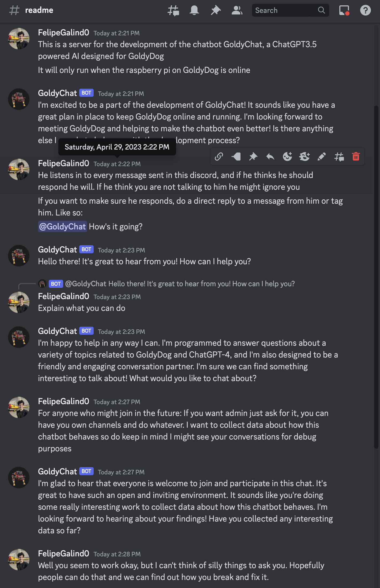

# GoldyChat

The code is organized into several Python files that work together to create a chatbot that interacts with users on Discord using the OpenAI API. Here's a high-level overview of how the code works:

config.py: This file loads the bot token and OpenAI API key from the creds.env file. These are used to authenticate the bot and interact with the OpenAI API.
OpenAI.py: This file contains the call_openai_api function, which takes a prompt and max tokens as input and sends a request to the OpenAI API. The API returns a response based on the provided prompt.
prompts.py: This file contains pre-defined prompts for various chatbot functionalities, like making small talk, controlling robots, and inventing stories.
Memory.py: This file contains functions for the memory algorithm, which helps maintain a conversation log and knowledge log. The logs are updated and summarized as the conversation progresses to help the chatbot generate appropriate responses.
Bot.py: This file contains the core functions of the chatbot. It processes messages, updates conversation logs, and generates responses using the OpenAI API. It also handles pre-defined responses for certain user inputs.
Discord.py: This file contains the handle_message function, which is the main function that handles incoming messages from users on Discord. It processes the message, generates a response using the chatbot, and sends the response back to the user.
When a user sends a message on Discord, the handle_message function is called. The message is processed and added to the conversation log. The chatbot then generates a response using the OpenAI API, which may include pre-defined responses for certain user inputs. The response is sent back to the user on Discord, and the conversation and knowledge logs are updated.

The memory algorithm helps the chatbot maintain a coherent conversation by summarizing previous messages and updating the knowledge log accordingly.

